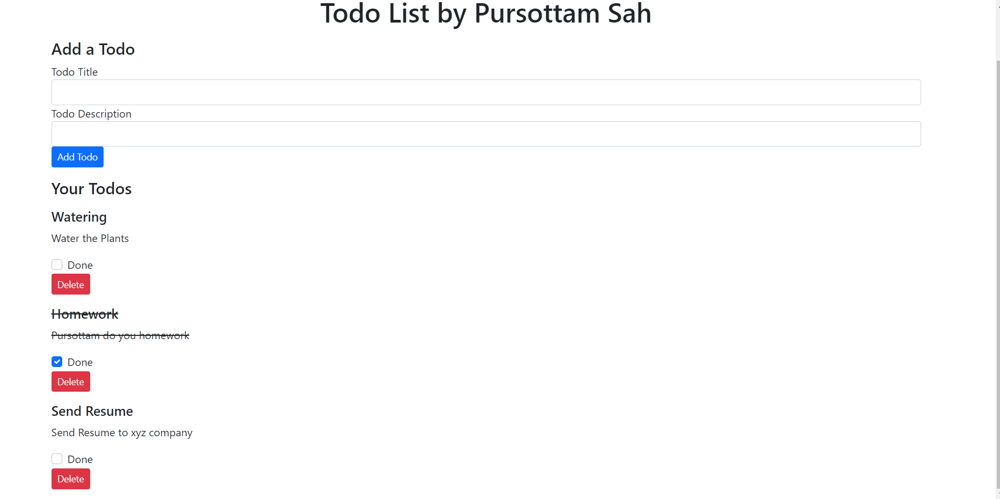

# Hello Everyone 

### This is my first project on angular.js so hope you may like 

### [Link](https://pursottam6003.github.io/MyTodoList/)
####  ⚡ A Todo-list for our daily  services/activities it is very important because sometimes we forgot to do our tasks that are very important for us.

#### ⚡  This can perform addition,removal and completion tasks on the basis of priority given by user.

#### ⚡ Also it provides the status of tasks completed and whole record of data can be stored into the JSON file. 

#### ⚡ As github can hold static files only so you may check after i will upload on heroku application 

#### Thank You for reading so patiently 